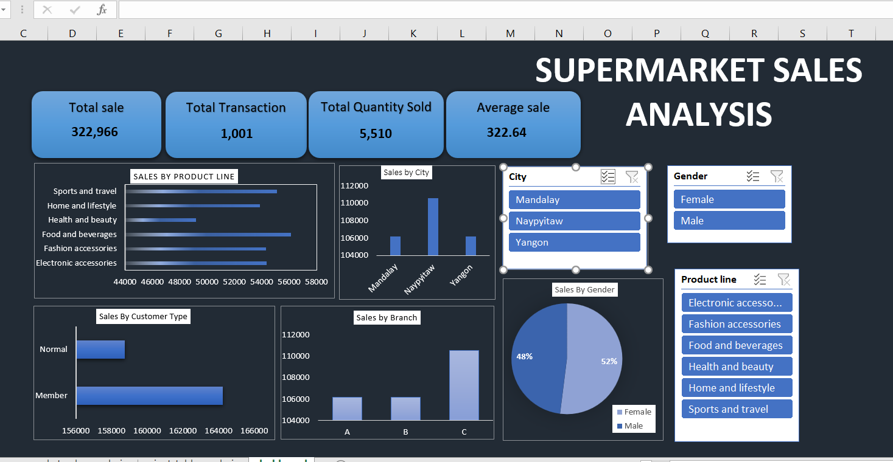

# supermarket sales excel dashboard
End-to-end sales analysis project using Excel to create an interactive dashboard and generate business insights.

## Project Overview
This project analyzes a supermarket sales dataset to understand sales performance, customer behavior, and product trends. An interactive dashboard was created using Microsoft Excel to visualize key metrics and provide actionable insights.

**TOOLS USED:**
* Microsoft Excel (Pivot Tables, Data Cleaning, Data Visualization, Slicers)

**KEY KPIs**
* Total Sales: 322,966
* Total Transactions: 1,001
* Total Quantity Sold: 5,510
* Average Sale Value: 322.64

**Dashboard Features**
The dashboard includes interactive analysis of:
* Sales by Product Line
* Sales by City
* Sales by Branch
* Sales by Gender
* Sales by Customer Type

- Users can filter the dashboard using slicers for:-
* City
* Gender
* Product Line

**Key Insights**
* Food & Beverages generate the highest revenue among product categories.
* Branch C shows the highest sales performance.
* Naypyitaw leads total sales among the cities.
* Member customers contribute more revenue than normal customers.
* Female customers generate slightly higher sales compared to male customers.

## Dashboard Preview

## Key Insights
* Food & Beverages generate the highest revenue
* Branch C shows the highest sales performance
* Naypyitaw leads total sales among cities
* Member customers contribute more revenue than normal customers
* Female customers generate slightly higher sales than male customers

## Business Impact
This analysis helps supermarket management identify top-performing products, understand customer behavior, and improve sales strategies across different locations and customer segments.

